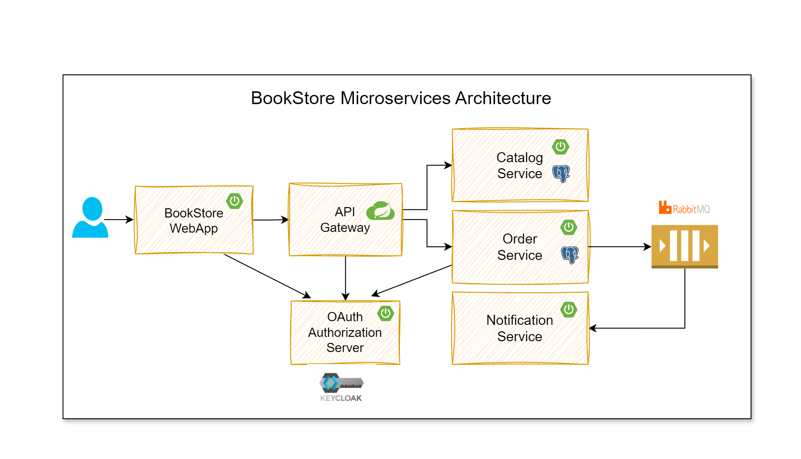

# Spring Boot Microservices Learning
Understanding spring boot microservices through bookstore project youtube tutorial by sivalabs

New things:

1. **Catalog Service with PostgreSQL**:
    - Docker Compose file (`infra.yml`) is used to set up the infrastructure.
    - Command to start: `docker compose -f infra.yml up -d`


2. **Swagger UI Integration**:
    - Added OpenAPI dependency for Swagger UI.


3. **Flyway Database Migration**.


4. **Controller, Service, and Repository Architecture**:
    - Controllers are in one package. Services and repositories are in another package.
    - Providing access protection eg:  for `ProductEntity` by removing `public` access.


5. **Pagination in Catalog Service Logic**.


6. **Record Usage**.


7. **Configuration Properties Annotation**.


8. **TestContainers for Testing**:
    - `test-data.sql` script runs before every test method.
    - Example: `@Sql("/test-data.sql")`


9. **RabbitMQ Listeners and Connection Establishment**.
    - Until i created the rabbitmq listeners and send controller rabbitmq connection establishment not happening.


10. **Embedding Customer in OrderEntity**:
    - In the `OrderEntity` class, we use the `@Embedded` annotation along with `@AttributeOverrides` to embed a `Customer` object within the entity. This allows us to store customer details directly within the `OrderEntity` table.

### Syntax

```java
@Embedded
@AttributeOverrides(
    value = {
        @AttributeOverride(name = "name", column = @Column(name = "customer_name")),
        @AttributeOverride(name = "email", column = @Column(name = "customer_email")),
        @AttributeOverride(name = "phone", column = @Column(name = "customer_phone"))
    }
)

//Here Customer is  a record in another file.

private Customer customer;

public record Customer(
        @NotBlank(message = "Customer Name is required") String name,
        @NotBlank(message = "Customer email is required") @Email String email,
        @NotBlank(message = "Customer Phone number is required") String phone) {}


```

11. **Instancio Usage**.


12. **Parameterized Tests**.
    - @ParameterizedTest in tests


13. **Resilience4j Usage**:
    - Retry and circuit breakers implemented.
    - Timeout from rest client only.


14. **WireMock for Service Mocking**.
    - Using wiremock we are mocking the service calling (eg: calling  service A to Service B )


15. **Pushing Events to RabbitMQ**.


16. **Scheduled Jobs with Locking**:
    - Using scheduled jobs and locking will come in picture when two or more instances of order service ran.

### Syntax

```java
@Scheduled(cron = "${orders.new-orders-job-cron}")
@SchedulerLock(name = "processNewOrders")
public void publishOrderEvents() {
        LockAssert.assertLocked();
        log.info("Publishing Order Events at {}", Instant.now());
        orderEventService.publishOrderEvents();
        }
```

17.**Using MailHog docker image for test mail**.

18. **JPA `existsBy` Method Support**.
    - Not only findBy...(something) this existsBy.. also supports Jpa .
### Syntax

```java
public interface OrderEventRepository extends JpaRepository<OrderEventEntity, Long> {
boolean existsByEventId(String eventId);
}
```

## API Content

### POST - http://localhost:8082/api/orders

```json
{
"customer" : {
"name": "jitendra",
"email": "jit@gmail.com",
"phone": "999999999"
},
"deliveryAddress" : {
"addressLine1": "test addressLine1",
"addressLine2": "bank-Straße 23",
"city": "rcpm",
"state": "APradesh",
"zipCode": "94258",
"country": "invalid"
},
"items": [
{
"code": "P101",
"name": "Product 2",
"price": 45.40,
"quantity": 1
}
]
}
 ``` 

### How to Run

1. **Start the Infrastructure**:
    - Start the infrastructure components by running the following command:
      ```bash
      docker compose -f infra.yml up -d
      ```
    - To stop the infrastructure, use:
      ```bash
      docker compose -f infra.yml stop
      ```
    - To restart the infrastructure, use:
      ```bash
      docker compose -f infra.yml restart
      ```

2. **Start Microservices**:
    - Once the infrastructure is up, start all the microservices.

3. **Access APIs with Swagger UI**:
    - After starting the microservices, you can access all the APIs using Swagger UI  ([http://localhost:8989](http://localhost:8989)).
   
### Architecture

